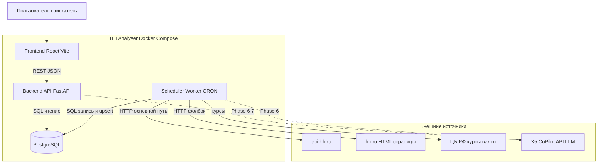
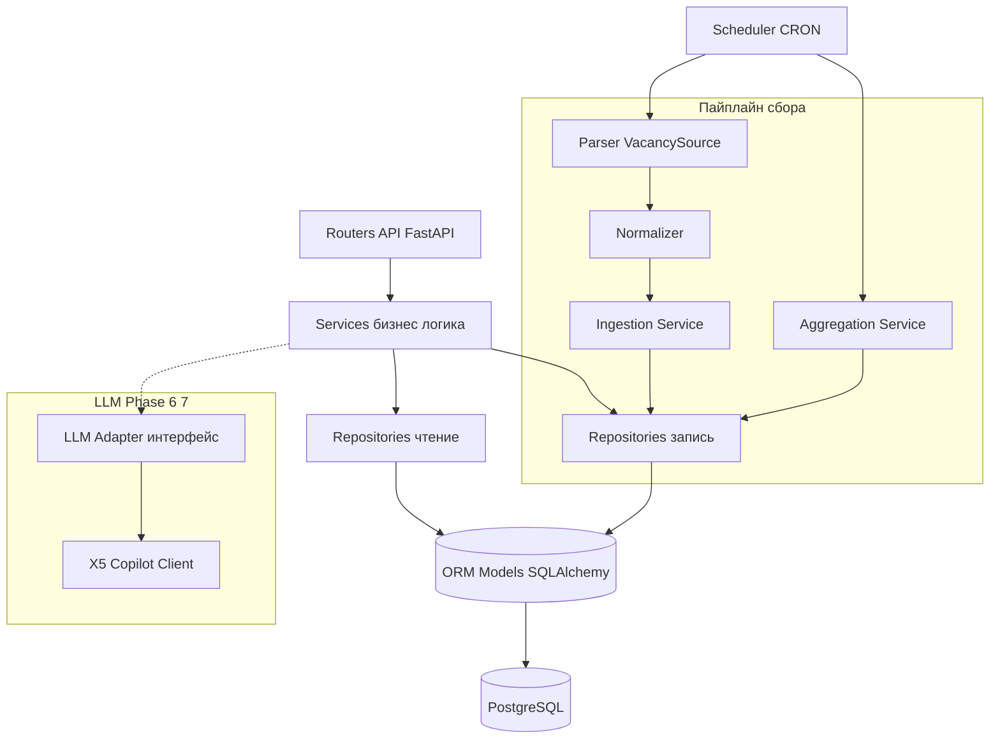
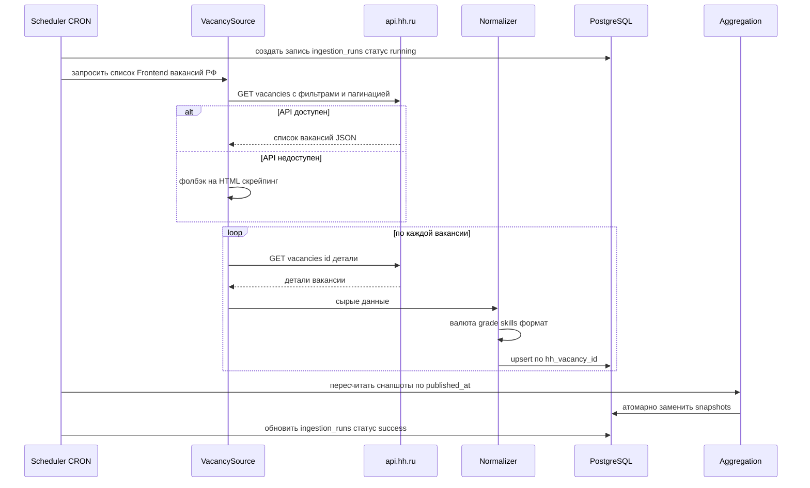
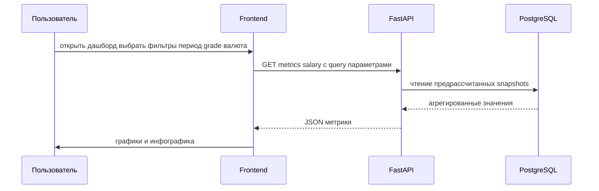
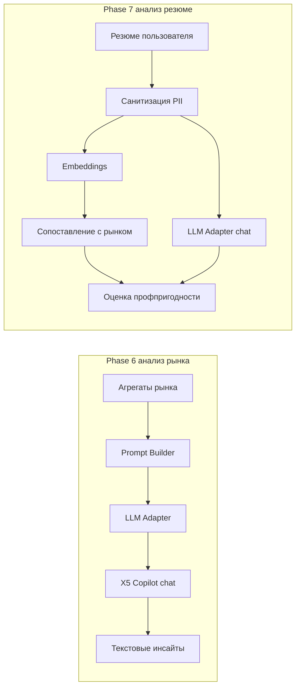
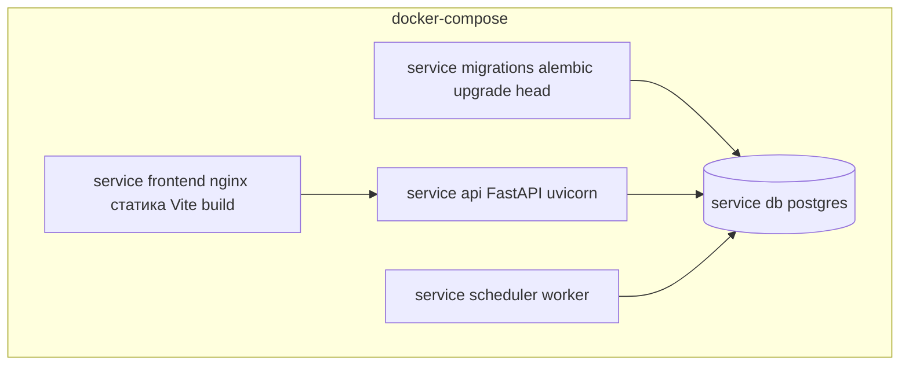

# 02 — Архитектура системы (Architecture)

> Диаграммы — в Mermaid. Внутри узлов диаграмм не используются кавычки и круглые скобки.

---

## 1. Обзор архитектуры

HH Analyser — это монорепозиторий с тремя исполняемыми сущностями, упакованными в Docker Compose:

1. **Backend API** (FastAPI) — REST-интерфейс для фронтенда; отдаёт агрегированные метрики.
2. **Scheduler** (worker) — ежедневный CRON-процесс: запускает парсер, нормализацию, запись в БД, пересчёт агрегаций.
3. **Frontend** (React + Vite) — дашборды и инфографика.

Хранилище — единая **PostgreSQL**. Внешние зависимости — `api.hh.ru` (+ HTML-фолбэк), источник курсов валют (ЦБ РФ) и LLM-провайдер (X5 CoPilot API, фазы 6–7).

## 2. Компоненты

### 2.1. Parser (источник данных)

- **Назначение:** получить «сырые» вакансии Frontend по РФ.
- **Стратегия:** primary — клиент `api.hh.ru`; fallback — HTML-скрейпер. Выбор стратегии инкапсулирован за общим интерфейсом `VacancySource`.
- **Особенности:** rate-limiting, retry/backoff, идентифицирующий `User-Agent`, сохранение `raw_payload`.

### 2.2. Normalizer (нормализация)

- Приводит сырые данные к доменной модели: валюты, gross/net, грейд, канонизация навыков, формат работы, опыт.
- Детерминированная и тестируемая логика (без сети).

### 2.3. Ingestion / Persistence (запись в БД)

- Идемпотентный **upsert** по `hh_vacancy_id`.
- Ведёт журнал прогонов `ingestion_runs`.
- Разделяет «факт вакансии» и связи (skills, employer, salary).

### 2.4. Scheduler (планировщик)

- Запуск ежедневно по CRON. В MVP — APScheduler внутри worker-процесса (альтернатива — системный cron, см. [`05-tech-stack.md`](05-tech-stack.md)).
- Оркестрирует пайплайн: parse → normalize → persist → aggregate.

### 2.5. Aggregation (агрегации/метрики)

- Считает метрики по `published_at` и сохраняет предрассчитанные **snapshots** по периодам (день/неделя/месяц/год) и срезам (грейд, валюта, gross/net).
- Пересчёт после каждого прогона; атомарная замена снапшотов.

### 2.6. API layer (FastAPI)

- Read-ориентированные эндпоинты для дашбордов с фильтрами.
- Слои: `routers` → `services` → `repositories` → `models`.

### 2.7. LLM-adapter (фазы 6–7)

- Абстрактный интерфейс `LLMClient` (методы `chat`, `embeddings`).
- Реализация `X5CopilotClient` поверх OpenAI-совместимого API (`base_url`, `Authorization: Bearer API_KEY`).
- Провайдер заменяем без изменения бизнес-логики (NFR-28).

### 2.8. Frontend (React + Vite)

- Презентационный слой: дашборды, графики, фильтры.
- Данные через REST; кэш — TanStack Query; собственного хранилища нет.

## 3. Слои бэкенда (layered architecture)

| Слой | Ответственность | Не должен |
|------|------------------|-----------|
| Routers | HTTP, валидация query/body, сериализация | Содержать бизнес-логику |
| Services | Бизнес-логика, оркестрация | Знать про HTTP/SQL детали |
| Repositories | Доступ к данным (CRUD, запросы) | Содержать бизнес-правила |
| Models | ORM-схема, типы | Содержать логику представления |
| Adapters | Внешние интеграции (LLM, источники) | Утекать наружу деталями провайдера |

## 4. Поток данных: ежедневный сбор (ingestion flow)

## 5. Поток данных: запрос дашборда (read flow)

## 6. Поток данных: LLM-фичи (Phase 6–7, проектно)

## 7. Развёртывание (deployment, Docker Compose)

- `migrations` выполняет `alembic upgrade head` перед стартом `api`/`scheduler`.
- Секреты (`API_KEY`, строка подключения к БД) — через env-файл, не в образах.

## 8. Ключевые архитектурные решения (ADR-сводка)

| # | Решение | Обоснование |
|---|---------|-------------|
| AD-1 | Разделение API и Scheduler на отдельные процессы | Изоляция нагрузки сбора от обслуживания запросов; независимое масштабирование |
| AD-2 | Предрасчёт снапшотов вместо запросов на лету | Производительность дашбордов (NFR-1, NFR-2) |
| AD-3 | Интерфейс `VacancySource` с primary/fallback | Устойчивость к изменениям hh.ru (FR-3) |
| AD-4 | Хранение `raw_payload` | Переобработка без повторного парсинга (FR-8) |
| AD-5 | Абстрактный `LLMClient` | Заменяемость провайдера (NFR-28) |
| AD-6 | Ось времени = `published_at` | Корректная рыночная статистика (FR-11) |
| AD-7 | Upsert по `hh_vacancy_id` | Идемпотентность сбора (FR-4) |
