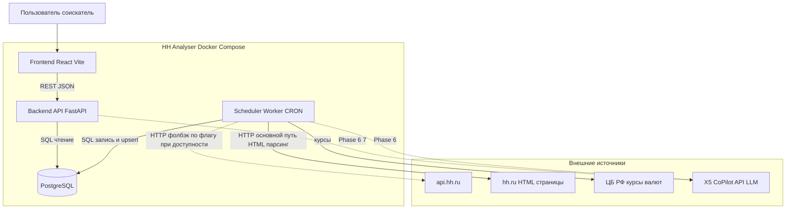
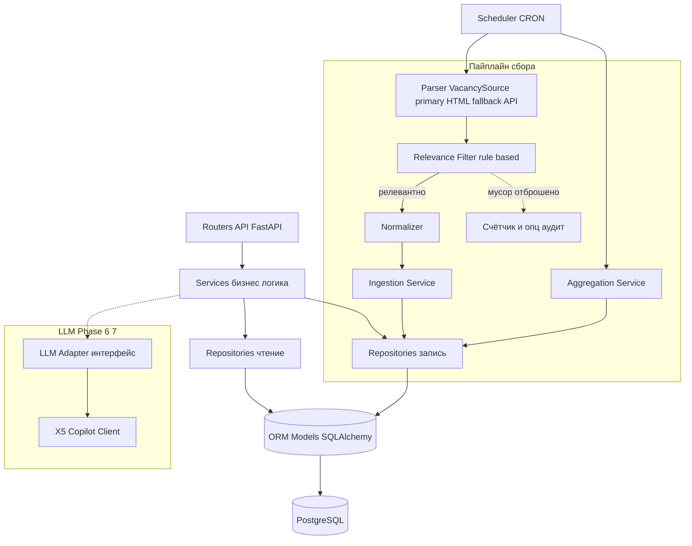
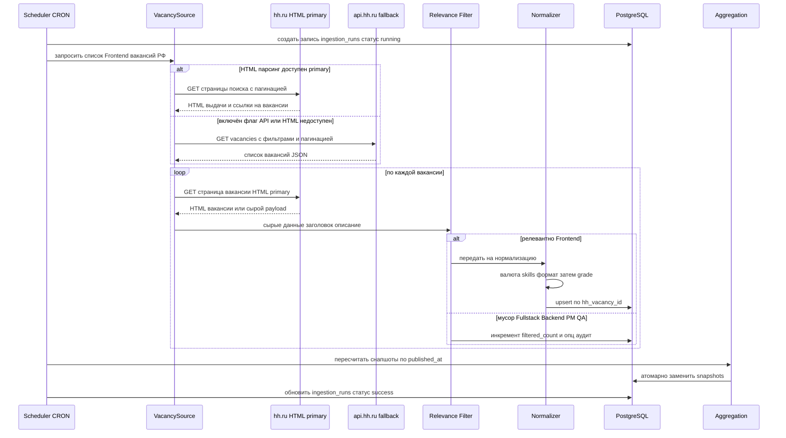
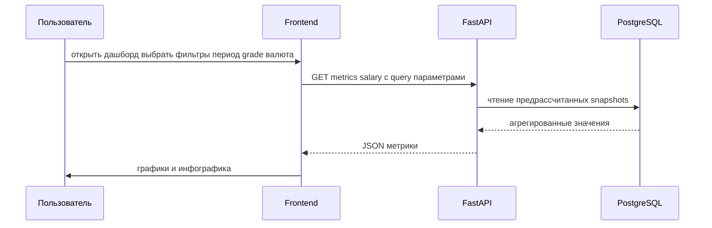
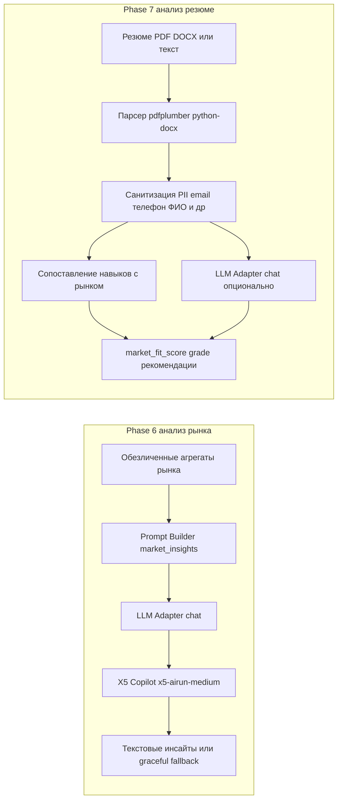
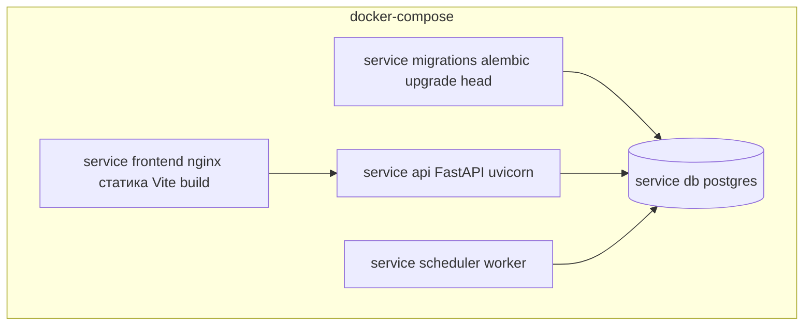

# 02 — Архитектура системы (Architecture)

> Диаграммы — в Mermaid. Внутри узлов диаграмм не используются кавычки и круглые скобки.
>
> **Статус:** финальная архитектура реализованного MVP (фазы 0–7). Все компоненты — parser (HTML primary), scheduler (APScheduler), relevance filter, normalizer, aggregation + snapshots, API, LLM-adapter (с CA-bundle), resume-analyzer, frontend — реализованы.

---

## 1. Обзор архитектуры

HH Analyser — это монорепозиторий с тремя исполняемыми сущностями, упакованными в Docker Compose:

1. **Backend API** (FastAPI) — REST-интерфейс для фронтенда; отдаёт агрегированные метрики.
2. **Scheduler** (worker) — ежедневный CRON-процесс: запускает парсер, нормализацию, запись в БД, пересчёт агрегаций.
3. **Frontend** (React + Vite) — дашборды и инфографика.

Хранилище — единая **PostgreSQL**. Внешние зависимости — HTML-страницы hh.ru (**основной источник**), `api.hh.ru` (фолбэк по флагу/при доступности), источник курсов валют (ЦБ РФ) и LLM-провайдер (X5 CoPilot API, фазы 6–7).

## 2. Компоненты

### 2.1. Parser (источник данных)

- **Назначение:** получить «сырые» вакансии Frontend по РФ.
- **Стратегия:** **primary — `HtmlVacancySource`** (HTML-парсинг страниц поиска и страниц вакансий hh.ru); **fallback — `ApiVacancySource`** (клиент `api.hh.ru`, помечен как «может быть недоступен; включается по флагу/при доступности»). Выбор реализации инкапсулирован за общим интерфейсом `VacancySource`; меняется только приоритет/порядок реализаций, сам интерфейс сохраняется.
- **Особенности HTML-парсинга:** конфигурируемые CSS-селекторы (устойчивость к смене вёрстки), обработка пагинации, обнаружение капчи/блокировок (без обхода защиты), вежливый краулинг (User-Agent с контактом, задержки), rate-limiting (aiolimiter), retry/backoff (tenacity), сохранение сырого HTML/`raw_payload` с `source_type`.

### 2.2. Normalizer (нормализация)

- Приводит сырые данные к доменной модели: валюты, gross/net, грейд, канонизация навыков, формат работы, опыт.
- Детерминированная и тестируемая логика (без сети).
- Грейд определяется **после** прохождения Relevance Filter (§2.3a, FR-47).

### 2.3a. Relevance Filter (фильтрация релевантности)

- **Назначение:** между извлечением (parse) и записью (upsert) отсеять нерелевантные («мусорные») вакансии (Fullstack, Backend, руководитель проектов, QA, DevOps, аналитик, дизайнер и т.п.), которые возвращает поиск hh.ru по запросу Frontend (FR-41).
- **Подход MVP — rule-based** (без LLM): скоринг по двум конфигурируемым словарям — **положительные маркеры** Frontend и **стоп-сигналы** (FR-42).
- **Источники сигналов:** заголовок вакансии (повышенный вес) и описание/ключевые навыки.
- **Политика разрешения конфликтов (по умолчанию):** считается `score = sum(вес положительных) - sum(вес стоп-сигналов)`; **приоритет заголовка над описанием** (вес сигналов из заголовка выше); вакансия принимается при `score >= relevance_threshold` (конфигурируемый порог). Явный стоп-сигнал в заголовке (например «руководитель проекта») может задавать жёсткий отброс независимо от score (конфигурируемо).
- **Конфигурируемость (FR-44):** словари и порог хранятся в конфиге и/или таблицах БД; правятся без изменения кода.
- **Результат:** релевантные вакансии идут на нормализацию и upsert; отброшенные **не сохраняются** как валидные, но считаются (FR-45) и опционально логируются в аудит (FR-46).

### 2.3. Ingestion / Persistence (запись в БД)

- Идемпотентный **upsert** по `hh_vacancy_id`.
- Ведёт журнал прогонов `ingestion_runs`.
- Разделяет «факт вакансии» и связи (skills, employer, salary).

### 2.4. Scheduler (планировщик)

- Запуск ежедневно по CRON. Реализация — **APScheduler `AsyncIOScheduler`** внутри отдельного worker-процесса (`app.scheduler.main`), cron-триггер (дефолт 03:00 `Europe/Moscow`).
- **Overlap-protection:** `max_instances=1`, `coalesce=True`, `misfire_grace_time` + asyncio-lock — параллельный/наложившийся прогон не запускается.
- Режим `--run-now` — немедленный разовый прогон и выход (для отладки/бэкфилла).
- Оркестрирует пайплайн: parse → **relevance filter** → normalize → persist → **aggregate (пересчёт snapshots после ingestion)**.
- Учёт по `published_at`; при upsert `published_at` **не перезаписывается**.
- Настройки: `SCHEDULER_CRON_HOUR/MINUTE`, `SCHEDULER_TIMEZONE`, `SCHEDULER_MAX_PAGES` (Optional, фолбэк на `HH_MAX_PAGES`), `SCHEDULER_MISFIRE_GRACE_TIME`. Пустые строки этих настроек безопасно трактуются валидаторами (Docker Compose передаёт `''` при отсутствии значения) — хотфикс Phase 3.

### 2.5. Aggregation (агрегации/метрики)

- Считает метрики M1–M5 по `published_at`. Реализован билдер snapshots (`snapshot_builder`) по периодам (день/неделя/месяц/год) и срезам (грейд, валюта, gross/net); пересчёт запускается после ingestion-джобы и доступен через CLI `rebuild-snapshots`.
- **Нюанс реализации MVP:** эндпоинты метрик считают агрегаты **on-the-fly** из БД; механизм `snapshots` готов для перехода на чтение из них при росте нагрузки (NFR-1/NFR-2 — целевая модель). Атомарная замена снапшотов поддержана билдером.

### 2.6. API layer (FastAPI)

- Read-ориентированные эндпоинты для дашбордов с фильтрами; единый конверт `{ meta, data }`.
- Слои: `routers` → `services` → `repositories` → `models`.

### 2.7. LLM-adapter (Phase 6–7 — реализовано)

- Абстрактный интерфейс `LLMClient` (методы `chat`, `embeddings`); реализация `X5CopilotClient` на `openai` SDK (`AsyncOpenAI`, `base_url`, `Authorization: Bearer API_KEY`).
- **Фабрика** `get_llm_client` управляется флагом `LLM_ENABLED` (+ наличие `API_KEY`); при отключении возвращает `None` → graceful-degradation.
- **TLS CA-bundle (NFR-32):** X5 CoPilot за внутренним корпоративным CA (sre-vault.x5.ru), отсутствующим в публичном `certifi`. При заданном `LLM_CA_BUNDLE` (путь к PEM) создаётся кастомный `httpx.AsyncClient` с этим CA через `ssl.create_default_context(cafile=...)`; **верификация TLS остаётся включённой**. Сертификат — `backend/certs/x5_root_ca.pem` (в `.gitignore`).
- Ретраи через tenacity (429/5xx/timeout — backoff + jitter); auth-ошибки (401/403) не ретраятся. `API_KEY` никогда не логируется (NFR-17).
- Провайдер заменяем без изменения бизнес-логики (NFR-28).

### 2.7a. Resume Analyzer (Phase 7 — реализовано)

- **Парсинг** входа: PDF (`pdfplumber`) / DOCX (`python-docx`) / raw-текст; лимит размера файла на уровне приложения.
- **Санитизация PII (NFR-16)** перед любым вызовом LLM: сервис `sanitizer` вырезает email, телефоны, URL, соцсети/@handle, **ФИО (в любом порядке слов)**, дату рождения, адрес, паспорт/СНИЛС/ИНН. Логируются только счётчики удалённых сущностей, не сами PII. Резюме **не персистится** (NFR-14).
- **Сопоставление навыков** резюме с рынком (matched / missing_in_demand / extra) на основе агрегаций по навыкам.
- **Результат:** `market_fit_score`, `estimated_grade`, `salary_range`, `passes_keyword_filters`, `strengths` / `weaknesses`, `recommendations`, счётчик удалённых PII. При отключённом/сбойном LLM — частичный rule-based результат (graceful-degradation), всегда конверт `{ meta, data }`.

### 2.8. Frontend (React + Vite)

- Презентационный слой: дашборд с 8 виджетами (Recharts) + KPI-карточки + виджет LLM-инсайтов; отдельный таб «Анализатор резюме».
- Глобальные фильтры: период (день/неделя/месяц/год), грейд, валюта, базис; состояния loading/error/empty/low_confidence; индикатор свежести данных.
- Навигация: таб «Дашборд | Анализатор резюме».
- Данные через REST; кэш — TanStack Query; собственного хранилища нет.

## 3. Слои бэкенда (layered architecture)

| Слой | Ответственность | Не должен |
|------|------------------|-----------|
| Routers | HTTP, валидация query/body, сериализация | Содержать бизнес-логику |
| Services | Бизнес-логика, оркестрация | Знать про HTTP/SQL детали |
| Repositories | Доступ к данным (CRUD, запросы) | Содержать бизнес-правила |
| Models | ORM-схема, типы | Содержать логику представления |
| Adapters | Внешние интеграции (LLM, источники) | Утекать наружу деталями провайдера |

## 4. Поток данных: ежедневный сбор (ingestion flow)

## 5. Поток данных: запрос дашборда (read flow)

## 6. Поток данных: LLM-фичи (Phase 6–7 — реализовано)

> Phase 7: сопоставление навыков реализовано rule-based на рыночных агрегациях; LLM (`chat`) обогащает результат, при его отключении/сбое возвращается частичный rule-based результат. В LLM не передаются сырые PII (санитизация до вызова).

## 7. Развёртывание (deployment, Docker Compose)

- `migrations` выполняет `alembic upgrade head` перед стартом `api`/`scheduler` (через `depends_on: service_completed_successfully`).
- Секреты (`API_KEY`, строка подключения к БД) — через env-файл, не в образах.
- **CA-bundle:** PEM с цепочкой внутреннего CA X5 бейкается в backend-образ (`/app/certs/x5_root_ca.pem`); путь задаётся `LLM_CA_BUNDLE`. В проде — через секреты K8s.
- **Важно:** Docker-образы бейкают код на build-time — перед запуском с изменениями нужна пересборка `docker compose build`.

## 8. Ключевые архитектурные решения (ADR-сводка)

| # | Решение | Обоснование |
|---|---------|-------------|
| AD-1 | Разделение API и Scheduler на отдельные процессы | Изоляция нагрузки сбора от обслуживания запросов; независимое масштабирование |
| AD-2 | Механизм предрасчёта снапшотов (билдер + CLI rebuild-snapshots + пересчёт после ingestion) | Производительность дашбордов (NFR-1, NFR-2); в MVP эндпоинты считают on-the-fly, snapshots готовы для перехода при росте нагрузки |
| AD-3 | Интерфейс `VacancySource`: primary `HtmlVacancySource`, fallback `ApiVacancySource` | api.hh.ru недоступен — HTML-парсинг primary; API включается по флагу/при доступности (FR-2, FR-3) |
| AD-4 | Хранение `raw_payload` | Переобработка без повторного парсинга (FR-8) |
| AD-5 | Абстрактный `LLMClient` | Заменяемость провайдера (NFR-28) |
| AD-6 | Ось времени = `published_at` | Корректная рыночная статистика (FR-11) |
| AD-7 | Upsert по `hh_vacancy_id` | Идемпотентность сбора (FR-4) |
| AD-8 | Отдельный шаг Relevance Filter (rule-based) перед нормализацией/записью | Отсев нерелевантных вакансий; нерелевантные не попадают в БД (FR-41–FR-47) |
| AD-9 | Конфигурируемые селекторы парсинга и словари релевантности | Устойчивость к смене вёрстки и корректировка правил без правки кода (FR-37, FR-44) |
| AD-10 | Кастомный `LLM_CA_BUNDLE` (PEM) при включённой TLS-верификации | X5 CoPilot за внутренним корпоративным CA, отсутствующим в `certifi`; доверие к цепочке без отключения проверки TLS (NFR-32) |
| AD-11 | Санитизация PII до вызова LLM; резюме не персистится | Приватность данных резюме; ФИО вырезается в любом порядке слов (NFR-14, NFR-16) |
| AD-12 | Graceful-degradation LLM-фич через фабрику с `LLM_ENABLED` | Дашборд и анализатор резюме работают даже при отключённом/сбойном LLM |
