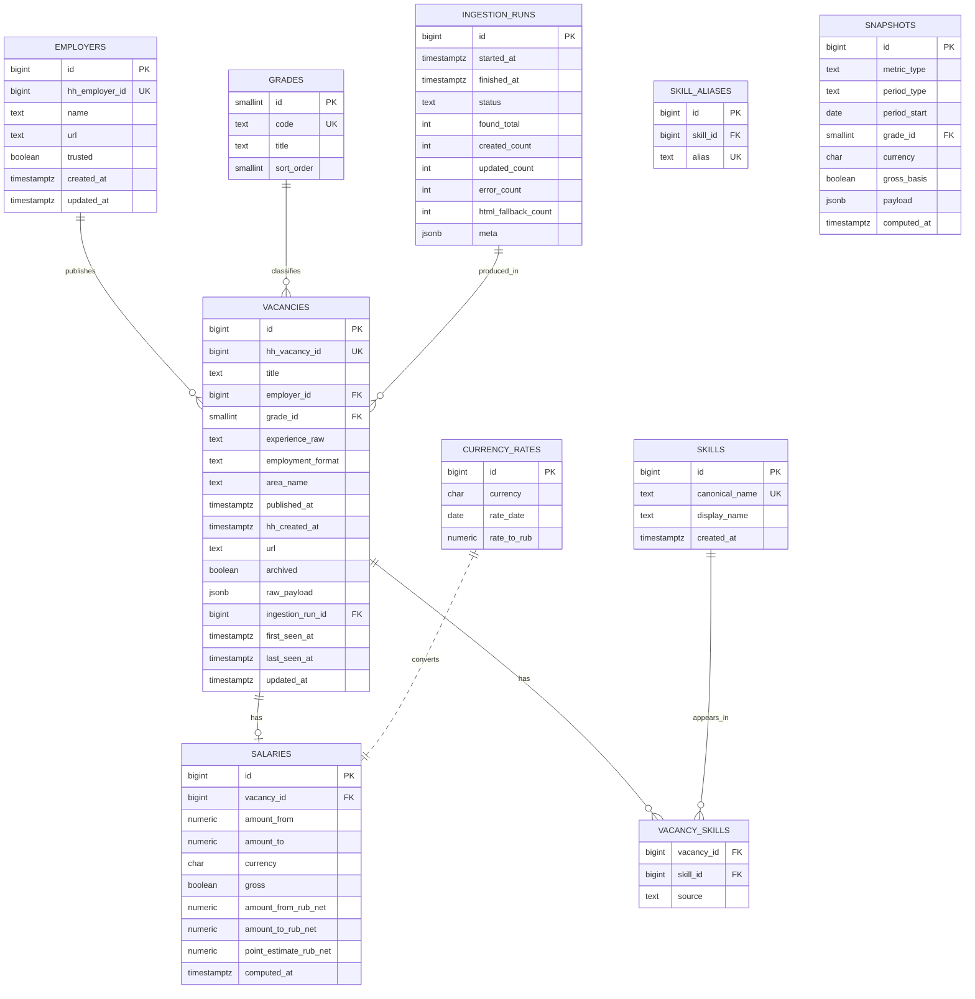
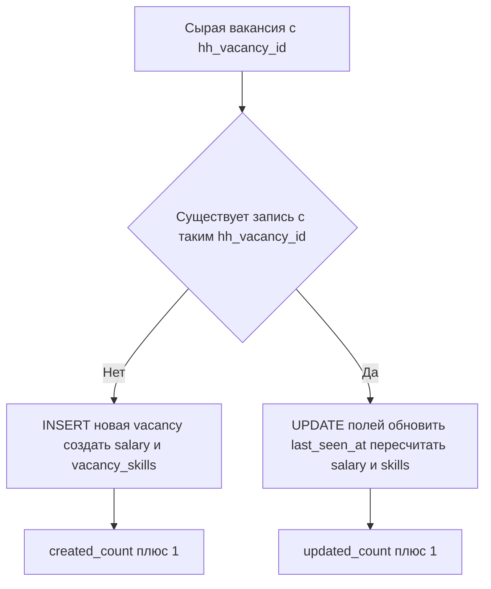

# 03 — Модель данных (Data Model, PostgreSQL)

> СУБД: PostgreSQL. ORM: SQLAlchemy 2.x. Миграции: Alembic.
> Ключевые принципы: учёт по `published_at` (FR-11), идемпотентность через `hh_vacancy_id` (FR-4, AD-7), хранение `raw_payload` (FR-8).

---

## 1. ER-диаграмма

> `SKILL_ALIASES` показан в ER-диаграмме как часть нормализации навыков (связь со `SKILLS`).

---

## 2. Описание таблиц

### 2.1. `employers` — работодатели

| Поле | Тип | Ограничения | Описание |
|------|-----|-------------|----------|
| `id` | `bigint` | PK, identity | Внутренний идентификатор |
| `hh_employer_id` | `bigint` | UNIQUE, NOT NULL | ID работодателя на hh.ru |
| `name` | `text` | NOT NULL | Название компании |
| `url` | `text` | NULL | Ссылка на профиль hh.ru |
| `trusted` | `boolean` | DEFAULT false | Флаг проверенного работодателя hh.ru |
| `created_at` | `timestamptz` | DEFAULT now() | |
| `updated_at` | `timestamptz` | DEFAULT now() | |

**Индексы:** `UNIQUE(hh_employer_id)`, `INDEX(name)`.

### 2.2. `grades` — справочник грейдов

| Поле | Тип | Ограничения | Описание |
|------|-----|-------------|----------|
| `id` | `smallint` | PK | |
| `code` | `text` | UNIQUE | `junior` / `middle` / `senior` / `unknown` |
| `title` | `text` | NOT NULL | Отображаемое название |
| `sort_order` | `smallint` | | Порядок сортировки |

Сид-данные: `junior`, `middle`, `senior`, `unknown`.

### 2.3. `vacancies` — вакансии (центральная таблица)

| Поле | Тип | Ограничения | Описание |
|------|-----|-------------|----------|
| `id` | `bigint` | PK, identity | |
| `hh_vacancy_id` | `bigint` | **UNIQUE, NOT NULL** | Глобальный ID вакансии на hh.ru — ключ дедупликации |
| `title` | `text` | NOT NULL | Название вакансии |
| `employer_id` | `bigint` | FK → employers.id | |
| `grade_id` | `smallint` | FK → grades.id | Определённый грейд |
| `experience_raw` | `text` | NULL | Опыт как у hh.ru (noExperience/between1And3/...) |
| `employment_format` | `text` | NULL | `office` / `remote` / `hybrid` / `unknown` |
| `area_name` | `text` | NULL | Город/регион |
| `published_at` | `timestamptz` | **NOT NULL, INDEX** | Дата публикации — ось времени метрик |
| `hh_created_at` | `timestamptz` | NULL | Дата создания на hh.ru |
| `url` | `text` | NULL | Ссылка на оригинал |
| `archived` | `boolean` | DEFAULT false | Архивная вакансия |
| `raw_payload` | `jsonb` | NULL | Сырой ответ источника (FR-8) |
| `ingestion_run_id` | `bigint` | FK → ingestion_runs.id | Прогон, в котором запись впервые создана |
| `first_seen_at` | `timestamptz` | DEFAULT now() | Когда впервые увидели |
| `last_seen_at` | `timestamptz` | DEFAULT now() | Когда последний раз подтвердили/обновили |
| `updated_at` | `timestamptz` | DEFAULT now() | |

**Индексы:**
- `UNIQUE(hh_vacancy_id)` — идемпотентный upsert.
- `INDEX(published_at)` — фильтры по периодам.
- `INDEX(grade_id, published_at)` — частый срез «грейд × период».
- `INDEX(employer_id)`.
- `GIN(raw_payload)` — при необходимости разбора JSON.

### 2.4. `salaries` — зарплаты (1:1 с вакансией)

| Поле | Тип | Ограничения | Описание |
|------|-----|-------------|----------|
| `id` | `bigint` | PK | |
| `vacancy_id` | `bigint` | FK → vacancies.id, UNIQUE | 1:1 |
| `amount_from` | `numeric(14,2)` | NULL | Нижняя граница «от» в исходной валюте |
| `amount_to` | `numeric(14,2)` | NULL | Верхняя граница «до» |
| `currency` | `char(3)` | NULL | ISO-код: RUB/USD/EUR/... |
| `gross` | `boolean` | NULL | true=gross, false=net, NULL=неизвестно |
| `amount_from_rub_net` | `numeric(14,2)` | NULL | Нормализовано: RUB, net |
| `amount_to_rub_net` | `numeric(14,2)` | NULL | Нормализовано: RUB, net |
| `point_estimate_rub_net` | `numeric(14,2)` | NULL | Точечная оценка для метрик (см. [`04-metrics.md`](04-metrics.md)) |
| `computed_at` | `timestamptz` | DEFAULT now() | Когда пересчитана нормализация |

> Вакансии **без зарплаты** не имеют строки в `salaries` (или имеют со всеми NULL) — исключаются из зарплатных метрик, но учитываются в counts (FR-18).

**Индексы:** `UNIQUE(vacancy_id)`, `INDEX(point_estimate_rub_net)`.

### 2.5. `skills` — справочник канонических навыков

| Поле | Тип | Ограничения | Описание |
|------|-----|-------------|----------|
| `id` | `bigint` | PK | |
| `canonical_name` | `text` | UNIQUE, NOT NULL | Каноническое имя (нижний регистр, нормализованное), напр. `react` |
| `display_name` | `text` | NOT NULL | Отображаемое, напр. `React` |
| `created_at` | `timestamptz` | DEFAULT now() | |

### 2.6. `skill_aliases` — алиасы навыков (канонизация)

| Поле | Тип | Ограничения | Описание |
|------|-----|-------------|----------|
| `id` | `bigint` | PK | |
| `skill_id` | `bigint` | FK → skills.id | |
| `alias` | `text` | UNIQUE, NOT NULL | напр. `reactjs`, `react.js` → react |

Назначение: схлопывание вариантов написания одного навыка в один канонический.

### 2.7. `vacancy_skills` — связь вакансия ↔ навык (M:N)

| Поле | Тип | Ограничения | Описание |
|------|-----|-------------|----------|
| `vacancy_id` | `bigint` | FK → vacancies.id | |
| `skill_id` | `bigint` | FK → skills.id | |
| `source` | `text` | DEFAULT 'key_skills' | `key_skills` (из API) или `description` (извлечено) |

**Ключ:** `PRIMARY KEY(vacancy_id, skill_id)`. **Индексы:** `INDEX(skill_id)`.

### 2.8. `currency_rates` — курсы валют

| Поле | Тип | Ограничения | Описание |
|------|-----|-------------|----------|
| `id` | `bigint` | PK | |
| `currency` | `char(3)` | NOT NULL | ISO-код валюты |
| `rate_date` | `date` | NOT NULL | Дата курса |
| `rate_to_rub` | `numeric(14,6)` | NOT NULL | Сколько RUB за 1 единицу валюты |

**Индексы:** `UNIQUE(currency, rate_date)`. Источник — ЦБ РФ (A2). Используется для нормализации зарплат на дату `published_at`.

### 2.9. `ingestion_runs` — журнал прогонов сбора

| Поле | Тип | Ограничения | Описание |
|------|-----|-------------|----------|
| `id` | `bigint` | PK | |
| `started_at` | `timestamptz` | NOT NULL | |
| `finished_at` | `timestamptz` | NULL | |
| `status` | `text` | NOT NULL | `running` / `success` / `partial` / `failed` |
| `found_total` | `int` | DEFAULT 0 | Найдено в источнике |
| `created_count` | `int` | DEFAULT 0 | Новых записей |
| `updated_count` | `int` | DEFAULT 0 | Обновлённых записей |
| `error_count` | `int` | DEFAULT 0 | Ошибок по вакансиям |
| `html_fallback_count` | `int` | DEFAULT 0 | Сколько раз сработал HTML-фолбэк |
| `meta` | `jsonb` | NULL | Доп. детали (фильтры, версии) |

Обеспечивает наблюдаемость (NFR-18, NFR-19) и статус-эндпоинт (FR-25).

### 2.10. `snapshots` — предрассчитанные агрегации

| Поле | Тип | Ограничения | Описание |
|------|-----|-------------|----------|
| `id` | `bigint` | PK | |
| `metric_type` | `text` | NOT NULL | `salary` / `skills` / `employers` / `grade_distribution` / `format_distribution` / `demand_trend` / `skill_cooccurrence` |
| `period_type` | `text` | NOT NULL | `day` / `week` / `month` / `year` |
| `period_start` | `date` | NOT NULL | Начало периода |
| `grade_id` | `smallint` | FK → grades.id, NULL | NULL = все грейды |
| `currency` | `char(3)` | NULL | Базис валюты (обычно RUB) |
| `gross_basis` | `boolean` | NULL | Базис gross/net |
| `payload` | `jsonb` | NOT NULL | Готовая структура метрики (значения, перцентили, топы) |
| `computed_at` | `timestamptz` | DEFAULT now() | |

**Индексы:** `UNIQUE(metric_type, period_type, period_start, grade_id, currency, gross_basis)`, `INDEX(metric_type, period_type, period_start)`.

> Снапшоты пересчитываются после каждого прогона и заменяются атомарно (NFR-7). Дашборды читают только их (NFR-2).

---

## 3. Идемпотентность и дедупликация

- **Ключ дедупликации:** `vacancies.hh_vacancy_id` (UNIQUE).
- **Операция:** `INSERT ... ON CONFLICT (hh_vacancy_id) DO UPDATE` (PostgreSQL upsert).
- `published_at` при обновлении **не меняется** (фиксируется при первом обнаружении из источника), что сохраняет корректность временной оси.
- Связи (`vacancy_skills`) пересобираются идемпотентно: удалить старые → вставить актуальные, либо diff.

## 4. Целостность и каскады

- `salaries.vacancy_id` → `ON DELETE CASCADE`.
- `vacancy_skills` → `ON DELETE CASCADE` по обеим сторонам.
- `vacancies.employer_id` → `ON DELETE SET NULL` (работодатель не должен удаляться в норме).
- Денормализованные `*_rub_net` в `salaries` пересчитываются при изменении логики/курсов (хранятся для скорости агрегаций).

## 5. Заметки по эволюции схемы

- Все изменения — через Alembic-миграции (NFR-27).
- Для перехода к большим объёмам — кандидат на партиционирование `vacancies` по `published_at` (range partitioning) в поздних фазах.
- `snapshots.payload` (JSONB) позволяет добавлять новые метрики без миграций структуры.
