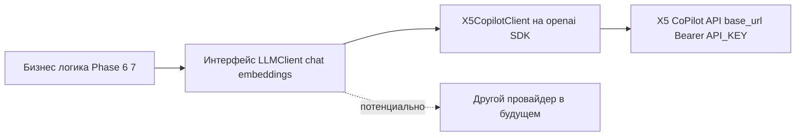

# 05 — Технологический стек (Tech Stack)

> Утверждённые заказчиком решения **зафиксированы** и не меняются; ниже — уточнение конкретными библиотеками, версиями и обоснованием.
> Принцип: использовать готовые проверенные библиотеки вместо самописных реализаций (для скорости разработки).

---

## 1. Сводная таблица (финальный выбор)

| Слой | Технология / библиотека | Назначение | Статус |
|------|--------------------------|------------|--------|
| Язык backend | **Python 3.12+** | основной язык | зафиксировано |
| Web-фреймворк | **FastAPI** | REST API | утверждено заказчиком |
| ASGI-сервер | **uvicorn** (+ gunicorn в prod) | запуск приложения | выбрано |
| ORM | **SQLAlchemy 2.x** | доступ к БД | выбрано |
| Миграции | **Alembic** | версионирование схемы | утверждено заказчиком |
| Валидация / схемы | **Pydantic v2** + **pydantic-settings** | DTO, конфиг из env | выбрано |
| БД | **PostgreSQL 16** | хранилище | утверждено заказчиком |
| Драйвер БД | **psycopg (v3)** | подключение | выбрано |
| HTTP-клиент | **httpx** | запросы к api.hh.ru | выбрано |
| HTML-парсинг | **selectolax** (primary) + **BeautifulSoup4** (fallback) | HTML-скрейпинг фолбэк | выбрано |
| Retry / backoff | **tenacity** | устойчивость сети | выбрано |
| Rate-limiting (исходящий) | **aiolimiter** | ограничение RPS к hh.ru | выбрано |
| Планировщик | **APScheduler** | ежедневный CRON | выбрано (альтернатива — системный cron) |
| Числовые расчёты | **numpy** (+ при необходимости **pandas**) | перцентили, агрегации | выбрано |
| LLM SDK | **openai** (Python) | клиент к X5 CoPilot API | выбрано (OpenAI-совместимый) |
| Логирование | **structlog** | структурные JSON-логи | выбрано |
| Тесты | **pytest** + **pytest-asyncio** + **respx** | юнит/интеграционные | выбрано |
| Линт/формат | **ruff** + **black** | качество кода | выбрано |
| Frontend | **React 18 + TypeScript** | UI | утверждено заказчиком (React) |
| Bundler | **Vite** | сборка/dev-сервер | утверждено заказчиком |
| Данные/кэш FE | **TanStack Query** | запросы и кэш | выбрано |
| Графики | **Recharts** (primary), **Apache ECharts** (для сложных/больших) | визуализация | выбрано |
| UI-компоненты | **shadcn/ui** + **Tailwind CSS** | дизайн-система | выбрано |
| HTTP FE | **axios** или нативный fetch | запросы к API | выбрано |
| Инфраструктура | **Docker + Docker Compose** | оркестрация локально | утверждено заказчиком |
| Линт FE | **ESLint + Prettier** | качество кода | выбрано |

---

## 2. Backend — обоснование выбора

- **FastAPI + Pydantic v2** — нативная валидация, автогенерация OpenAPI (полезно для контракта в [`06-api-contract.md`](06-api-contract.md)), async.
- **SQLAlchemy 2.x + Alembic** — зрелый ORM с типизацией 2.0-стиля; Alembic — стандарт миграций (NFR-27).
- **psycopg v3** — современный драйвer PostgreSQL с поддержкой async и JSONB.
- **httpx** — async HTTP, удобен для пагинации api.hh.ru; интегрируется с tenacity и aiolimiter.
- **selectolax** — очень быстрый HTML-парсер (lexbor); BeautifulSoup4 — запасной для сложных случаев. Используются только в фолбэке (FR-3).
- **tenacity** — retry с экспоненциальным backoff и jitter (NFR-5); **aiolimiter** — token-bucket лимит RPS (NFR-9).
- **APScheduler** — планировщик внутри worker-процесса; альтернатива — системный cron, вызывающий CLI-команду. Рекомендация: APScheduler для MVP (проще в одном Docker-стеке), с возможностью перейти на cron/Celery beat при росте.
- **numpy** — перцентили/медианы (M1); альтернатива — SQL `percentile_cont` на стороне PostgreSQL (используется для тяжёлых агрегаций).
- **structlog** — JSON-логи с correlation-id (NFR-18).

## 3. Frontend — обоснование выбора

- **React + TypeScript + Vite** — быстрый dev-цикл, типобезопасность.
- **TanStack Query** — кэширование ответов API, фоновые рефетчи; реализует «минимальное хранение на фронте» (FR-31).
- **Recharts** — декларативные React-графики (линии, бары, area) — покрывает дашборды; **ECharts** — для тяжёлых/интерактивных визуализаций (heatmap совстречаемости навыков, box-plot зарплат).
- **Tailwind + shadcn/ui** — быстрая, консистентная вёрстка дашбордов.

## 4. Инфраструктура

`docker-compose` сервисы (см. [`02-architecture.md`](02-architecture.md) §7):

| Сервис | Образ/база | Назначение |
|--------|------------|------------|
| `db` | postgres:16 | БД |
| `migrations` | backend-образ | `alembic upgrade head` (one-shot перед api/scheduler) |
| `api` | backend-образ | FastAPI (uvicorn/gunicorn) |
| `scheduler` | backend-образ | APScheduler worker |
| `frontend` | node build → nginx | статика Vite |

Конфигурация — через `.env` (NFR-22). Backend и scheduler используют один образ, разные entrypoint.

## 5. LLM-интеграция: X5 CoPilot API (Phase 6–7)

> Источник: [`CopilotAPI.pdf`](../CopilotAPI.pdf) (прочитан). Ключ доступа — в `.env` → `API_KEY`.

### 5.1. Базовые параметры (из документации)

| Параметр | Значение |
|----------|----------|
| Протокол | **OpenAI-совместимый** (можно использовать SDK `openai`) |
| Base URL (CoPilot API 2.0) | `https://api-copilot.x5.ru/aigw/v1/` |
| Base URL (альт., CoPilot API) | `https://api-copilot.x5.ru/v1/` |
| Аутентификация | заголовок `Authorization: Bearer <API_KEY>` |
| Chat | `POST /chat/completions` |
| Embeddings | `POST /embeddings` |
| Список моделей | `GET /models` |
| Транскрипция аудио | `POST /audio/transcriptions` |
| Возможности | tool-calling (OpenAI-формат), streaming |

### 5.2. Доступные модели (по документации)

| Модель | Назначение | Контекст |
|--------|------------|----------|
| `x5-airun-large` | крупная (DeepSeek V4 Flash), анализ/научные тексты | 131 072 |
| `x5-airun-medium` | Qwen3.6-27B, **адаптирована под русский**, сложные задачи | 65 536 |
| `x5-airun-small` | размышляющая, простые задачи, чат-боты | 65 536 |
| `x5-airun-multilingual-e5-large` | **embeddings** (поиск, семантическое сходство) | 512 |
| `x5-airun-embed-4b` | **embeddings** (Qwen3-Embedding-4B), поиск/ранжирование | 2560 |

**Рекомендации проекта:**
- Phase 6 (анализ рынка, русскоязычные инсайты) → `x5-airun-medium` (баланс качества и русского языка), при необходимости глубины → `x5-airun-large`.
- Phase 7 (сопоставление резюме с рынком через embeddings) → `x5-airun-embed-4b` или `x5-airun-multilingual-e5-large`; генерация рекомендаций → `x5-airun-medium`.

### 5.3. Абстрактный LLM-adapter (NFR-28, FR-34)

Несмотря на то, что провайдер известен, доступ к LLM проектируется через интерфейс, чтобы провайдер оставался **заменяемым**:



Контракт интерфейса (концептуально):
- `chat(messages, model, **params) -> str` — генерация текста/инсайтов.
- `embeddings(texts, model) -> list[vector]` — векторизация для сопоставления.
- Конфигурация (`base_url`, `api_key`, `model`) — из env через pydantic-settings.

Пример инициализации (концептуально, OpenAI SDK):

```python
from openai import OpenAI
client = OpenAI(
    base_url="https://api-copilot.x5.ru/aigw/v1/",
    api_key=settings.API_KEY,
)
resp = client.chat.completions.create(
    model="x5-airun-medium",
    messages=[{"role": "user", "content": "..."}],
)
```

### 5.4. Открытые вопросы по LLM (уточнить на Phase 6)

- **Точные лимиты/квоты** запросов и токенов для нашего ключа (`GET /api_key/info`).
- **Доступность конкретных моделей** для нашего токена (`GET /models` — состав зависит от способа интеграции).
- **Тип интеграции** (частное лицо vs клиентская система) и соответствующий Base URL.
- **Политика передачи данных резюме** во внешний LLM (см. NFR-16): требуется санитизация PII перед отправкой; подтвердить допустимость на этапе реализации Phase 7.
- Необходимость **streaming** и **tool-calling** для наших сценариев (вероятно, базовый chat достаточно для Phase 6).

> Эти детали не блокируют MVP (Phase 1–5): LLM используется только с Phase 6. Адаптер изолирует риск изменения провайдера/параметров.

## 6. Версии (зафиксировать на Phase 1)

Точные версии библиотек фиксируются в `pyproject.toml` / `package.json` на Phase 1 (каркас). Здесь зафиксирован выбор библиотек и их роли; конкретные pinned-версии — артефакт Phase 1.
