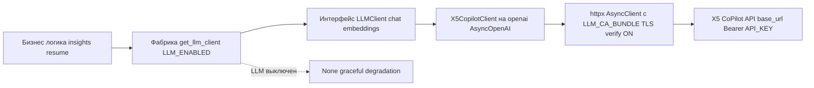

# 05 — Технологический стек (Tech Stack)

> Утверждённые заказчиком решения **зафиксированы** и не меняются; ниже — уточнение конкретными библиотеками, версиями и обоснованием.
> Принцип: использовать готовые проверенные библиотеки вместо самописных реализаций (для скорости разработки).
>
> **Статус:** финальный стек реализованного MVP. Pinned-версии — в [`backend/requirements.txt`](../backend/requirements.txt) и [`frontend/package.json`](../frontend/package.json).

---

## 1. Сводная таблица (финальный выбор)

| Слой | Технология / библиотека | Назначение | Статус |
|------|--------------------------|------------|--------|
| Язык backend | **Python 3.12+** | основной язык | зафиксировано |
| Web-фреймворк | **FastAPI** | REST API | утверждено заказчиком |
| ASGI-сервер | **uvicorn** (+ gunicorn в prod) | запуск приложения | выбрано |
| ORM | **SQLAlchemy 2.x** | доступ к БД | выбрано |
| Миграции | **Alembic** | версионирование схемы | утверждено заказчиком |
| Валидация / схемы | **Pydantic v2** + **pydantic-settings** | DTO, конфиг из env | выбрано |
| БД | **PostgreSQL 16** | хранилище | утверждено заказчиком |
| Драйвер БД | **psycopg (v3)** | подключение | выбрано |
| HTTP-клиент | **httpx** | HTTP-краулинг HTML-страниц hh.ru (primary) и запросы к api.hh.ru (fallback) | выбрано |
| HTML-парсинг (**основной путь**) | **selectolax** (primary-парсер, lexbor) + **BeautifulSoup4** (для сложных случаев) | парсинг страниц поиска и вакансий hh.ru — primary источник данных | выбрано |
| Retry / backoff | **tenacity** | устойчивость сети и краулинга (ретраи, backoff, jitter) | выбрано |
| Rate-limiting (исходящий) | **aiolimiter** | ограничение RPS и вежливый краулинг hh.ru | выбрано |
| Планировщик | **APScheduler** | ежедневный CRON | выбрано (альтернатива — системный cron) |
| Числовые расчёты | **numpy** | перцентили, агрегации (M1) | реализовано |
| LLM SDK | **openai** (Python, `AsyncOpenAI`) | клиент к X5 CoPilot API | реализовано (OpenAI-совместимый) |
| Парсинг резюме PDF | **pdfplumber** | извлечение текста из PDF-резюме (Phase 7) | реализовано |
| Парсинг резюме DOCX | **python-docx** | извлечение текста из DOCX-резюме (Phase 7) | реализовано |
| Multipart-формы | **python-multipart** | загрузка файлов резюме (multipart/form-data) | реализовано |
| Логирование | **structlog** | структурные JSON-логи | выбрано |
| Тесты | **pytest** + **pytest-asyncio** + **respx** | юнит/интеграционные | выбрано |
| Линт/формат | **ruff** + **black** | качество кода | выбрано |
| Frontend | **React 18 + TypeScript** | UI | утверждено заказчиком (React) |
| Bundler | **Vite** | сборка/dev-сервер | утверждено заказчиком |
| Данные/кэш FE | **TanStack Query** | запросы и кэш | выбрано |
| Графики | **Recharts** (primary), **Apache ECharts** (для сложных/больших) | визуализация | выбрано |
| UI-компоненты | **shadcn/ui** + **Tailwind CSS** | дизайн-система | выбрано |
| HTTP FE | **axios** или нативный fetch | запросы к API | выбрано |
| Инфраструктура | **Docker + Docker Compose** | оркестрация локально | утверждено заказчиком |
| Линт FE | **ESLint + Prettier** | качество кода | выбрано |

---

## 2. Backend — обоснование выбора

- **FastAPI + Pydantic v2** — нативная валидация, автогенерация OpenAPI (полезно для контракта в [`06-api-contract.md`](06-api-contract.md)), async.
- **SQLAlchemy 2.x + Alembic** — зрелый ORM с типизацией 2.0-стиля; Alembic — стандарт миграций (NFR-27).
- **psycopg v3** — современный драйвer PostgreSQL с поддержкой async и JSONB.
- **httpx** — async HTTP; основной путь — краулинг HTML-страниц hh.ru (поиск + вакансии) с пагинацией; интегрируется с tenacity и aiolimiter. Тот же клиент используется для API-фолбэка `api.hh.ru`, когда он доступен (FR-3).
- **selectolax** — очень быстрый HTML-парсер (lexbor) — **основной инструмент извлечения** данных из HTML hh.ru (FR-2); BeautifulSoup4 — для сложных/нестабильных участков вёрстки. CSS-селекторы выносятся в конфиг для устойчивости к изменению вёрстки (FR-37, NFR-11).
- **tenacity** — retry с экспоненциальным backoff и jitter (NFR-5, NFR-31); капча/блокировка трактуется как сигнал к паузе, а не к агрессивным ретраям (FR-39). **aiolimiter** — token-bucket лимит RPS + задержки для вежливого краулинга (NFR-9).
- **APScheduler** — планировщик внутри worker-процесса; альтернатива — системный cron, вызывающий CLI-команду. Рекомендация: APScheduler для MVP (проще в одном Docker-стеке), с возможностью перейти на cron/Celery beat при росте.
- **numpy** — перцентили/медианы (M1); альтернатива — SQL `percentile_cont` на стороне PostgreSQL (используется для тяжёлых агрегаций).
- **structlog** — JSON-логи с correlation-id (NFR-18).

## 3. Frontend — обоснование выбора

- **React + TypeScript + Vite** — быстрый dev-цикл, типобезопасность.
- **TanStack Query** — кэширование ответов API, фоновые рефетчи; реализует «минимальное хранение на фронте» (FR-31).
- **Recharts** — декларативные React-графики (линии, бары, area) — покрывает дашборды; **ECharts** — для тяжёлых/интерактивных визуализаций (heatmap совстречаемости навыков, box-plot зарплат).
- **Tailwind + shadcn/ui** — быстрая, консистентная вёрстка дашбордов.

## 4. Инфраструктура

`docker-compose` сервисы (см. [`02-architecture.md`](02-architecture.md) §7):

| Сервис | Образ/база | Назначение |
|--------|------------|------------|
| `db` | postgres:16 | БД |
| `migrations` | backend-образ | `alembic upgrade head` (one-shot перед api/scheduler) |
| `api` | backend-образ | FastAPI (uvicorn/gunicorn) |
| `scheduler` | backend-образ | APScheduler worker |
| `frontend` | node build → nginx | статика Vite |

Конфигурация — через `.env` (NFR-22). Backend и scheduler используют один образ, разные entrypoint.

## 5. LLM-интеграция: X5 CoPilot API (Phase 6–7 — реализовано)

> Источник: [`CopilotAPI.pdf`](../CopilotAPI.pdf) (прочитан). Ключ доступа — в `.env` → `API_KEY`.
> **Статус:** реализовано и **подтверждено live** под реальным токеном (`GET /models`).

### 5.1. Базовые параметры (фактические)

| Параметр | Значение |
|----------|----------|
| Протокол | **OpenAI-совместимый** (SDK `openai`, `AsyncOpenAI`) |
| Base URL (CoPilot API 2.0) | `https://api-copilot.x5.ru/aigw/v1/` — **используется** (`LLM_BASE_URL`) |
| Аутентификация | заголовок `Authorization: Bearer <API_KEY>` |
| Chat | `POST /chat/completions` |
| Embeddings | `POST /embeddings` |
| Список моделей | `GET /models` |
| TLS | внутренний корпоративный CA X5 → `LLM_CA_BUNDLE` (PEM), верификация ВКЛ (NFR-32) |

### 5.2. Доступные модели (подтверждено live)

| Модель | Назначение | Статус |
|--------|------------|--------|
| `x5-airun-medium` | чат, **адаптирована под русский** | ✅ используется для инсайтов/резюме; доступность подтверждена live |
| `x5-airun-embed-4b` | **embeddings** (Qwen3-Embedding-4B) | ✅ доступность подтверждена live |
| `x5-airun-large` | крупная, анализ/научные тексты | по документации (в MVP не используется) |
| `x5-airun-small` | простые задачи, чат-боты | по документации (в MVP не используется) |
| `x5-airun-multilingual-e5-large` | embeddings (e5) | по документации (в MVP не используется) |

**Фактический выбор:**
- Phase 6 (анализ рынка, русскоязычные инсайты) → `x5-airun-medium` (`LLM_MODEL` по умолчанию).
- Phase 7 (анализатор резюме) → чат `x5-airun-medium`; embeddings-модель `x5-airun-embed-4b` подтверждена доступной (в MVP сопоставление навыков — rule-based на агрегациях).

### 5.3. Абстрактный LLM-adapter (NFR-28, FR-34 — реализовано)

Доступ к LLM реализован через интерфейс, чтобы провайдер оставался **заменяемым**:

Контракт интерфейса (фактический):
- `chat(messages, model, **params) -> LLMResponse` — генерация текста/инсайтов.
- `embeddings(texts, model) -> list[vector]` — векторизация для сопоставления.
- Конфигурация (`base_url`, `api_key`, `model`, `LLM_CA_BUNDLE`, тайм-ауты, ретраи) — из env через pydantic-settings.
- **Фабрика** `get_llm_client()` возвращает `None`, если `LLM_ENABLED=false` или нет `API_KEY` → бизнес-логика переходит в graceful-degradation.
- Ретраи через **tenacity** (429/5xx/timeout — backoff + jitter); auth-ошибки (401/403) не ретраятся. `API_KEY` не логируется (NFR-17).

**TLS CA-bundle (NFR-32):** X5 CoPilot за внутренним корпоративным CA (sre-vault.x5.ru), отсутствующим в публичном `certifi`. При заданном `LLM_CA_BUNDLE` создаётся кастомный `httpx.AsyncClient(verify=ssl.create_default_context(cafile=...))`, передаваемый в `AsyncOpenAI`; **верификация TLS остаётся включённой**. Сертификат — `backend/certs/x5_root_ca.pem` (в `.gitignore`; в проде — секреты K8s).

### 5.4. Открытые вопросы по LLM — ЗАКРЫТЫ (Phase 6)

- ✅ **Доступность моделей** для нашего токена: `x5-airun-medium` и `x5-airun-embed-4b` подтверждены live через `GET /models`.
- ✅ **Base URL / тип интеграции:** используется `https://api-copilot.x5.ru/aigw/v1/` (CoPilot API 2.0), доступ подтверждён под реальным токеном.
- ✅ **Политика передачи данных резюме** (NFR-16): реализована санитизация PII до вызова LLM (email, телефоны, URL, соцсети, ФИО в любом порядке, дата рождения, адрес, паспорт/СНИЛС/ИНН); в инсайты рынка подаются только обезличенные агрегаты.
- ✅ **TLS:** решена проблема внутреннего CA через `LLM_CA_BUNDLE` без отключения верификации (NFR-32).
- **streaming / tool-calling** — для сценариев MVP не требовались (базовый chat достаточен); остаются доступны при необходимости.

## 6. Версии (pinned)

Pinned-версии зафиксированы в [`backend/requirements.txt`](../backend/requirements.txt) и [`frontend/package.json`](../frontend/package.json). Ключевые backend-зависимости: `fastapi`, `uvicorn`/`gunicorn`, `sqlalchemy[asyncio]`, `psycopg`, `alembic`, `pydantic`/`pydantic-settings`, `httpx`, `apscheduler`, `structlog`, `numpy`, `openai`, `tenacity`, `aiolimiter`, `selectolax`, `beautifulsoup4`, `pdfplumber`, `python-docx`, `python-multipart`, `pytest`/`pytest-asyncio`, `ruff`/`black`.
