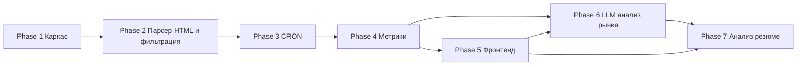

# 07 — Дорожная карта (Roadmap)

> Методология: итеративная поставка. Каждая фаза — независимо проверяемый инкремент с чёткими критериями приёмки (Definition of Done).
> Оценки трудозатрат намеренно не приводятся.
>
> **Статус: все фазы 0–7 завершены (Completed).** MVP реализован и проверен на живых сервисах; 205 бэкенд-тестов зелёные. Промежуточные валидации (2.5, 4.5, 6.5, 7.5) и хотфикс scheduler зафиксированы ниже. Известные ограничения и дальнейшие шаги — в §3.

---

## 1. Обзор фаз и зависимостей

| Фаза | Название | Зависит от | Статус |
|------|----------|------------|--------|
| 1 | Каркас проекта | — | ✅ Completed |
| 2 | Парсер hh.ru HTML primary + Relevance Filtering + нормализация + запись | 1 | ✅ Completed |
| 3 | CRON-планировщик | 2 | ✅ Completed |
| 4 | Агрегации/метрики + фильтры | 2, 3 | ✅ Completed |
| 5 | Фронтенд-дашборды | 4 | ✅ Completed |
| 6 | LLM-анализ рынка | 4, 5 | ✅ Completed |
| 7 | Умный анализатор резюме | 5, 6 | ✅ Completed |

---

## Phase 1 — Каркас проекта ✅ Completed

**Цель:** работающий «скелет» монорепозитория, поднимающийся одной командой.

**Объём работ:**
- Структура монорепо (`backend/`, `frontend/`, `docker-compose.yml`, `.env.example`).
- Backend: FastAPI-приложение, `/api/v1/health`, конфиг через pydantic-settings, structlog.
- БД: PostgreSQL в Compose, подключение через SQLAlchemy, инициализация Alembic (пустая baseline-миграция).
- Frontend: React + Vite + TypeScript, заглушка-страница, обращение к `/health`.
- Линтеры/форматтеры (ruff, black, ESLint, Prettier), `pyproject.toml` / `package.json` с pinned-версиями.
- `migrations`-сервис (`alembic upgrade head`).

**Deliverables:**
- `docker compose up` поднимает db + migrations + api + frontend.
- Репозиторий со структурой, README по запуску.

**Definition of Done:**
- [ ] `docker compose up` стартует все сервисы без ошибок.
- [ ] `GET /api/v1/health` отвечает `{ "status": "ok" }`.
- [ ] Frontend открывается и успешно вызывает `/health`.
- [ ] `alembic upgrade head` применяется к чистой БД.
- [ ] Линтеры проходят на CI/локально.

**Зависимости:** нет.

---

## Phase 2 — Парсер hh.ru (HTML primary) + Relevance Filtering + нормализация + запись в БД ✅ Completed

**Цель:** наполнить БД нормализованными и **релевантными** Frontend-вакансиями по РФ, собирая их через **HTML-парсинг как основной путь** (api.hh.ru недоступен — fallback по флагу/при доступности).

**Объём работ:**
- Alembic-миграции под схему из [`03-data-model.md`](03-data-model.md) (employers, vacancies с `source_type`/`raw_html`, salaries, skills, skill_aliases, vacancy_skills, grades, currency_rates, ingestion_runs с `filtered_count`/`api_fallback_count`/`captcha_block_count`; опционально `filtered_vacancies`; `relevance_terms`).
- **`HtmlVacancySource` (primary)** на httpx + selectolax/BeautifulSoup: краулинг страниц поиска Frontend по РФ с пагинацией, парсинг страниц вакансий, **конфигурируемые CSS-селекторы** (FR-37), сохранение `raw_html` (FR-40), обнаружение капчи/блокировок без обхода защиты (FR-39).
- **`ApiVacancySource` (fallback)** на httpx: клиент `api.hh.ru` (поиск + детали по `id`), **включается по флагу/при доступности** (FR-3). Единый интерфейс `VacancySource`, primary/fallback переключаемы.
- Вежливый краулинг: rate-limiting (aiolimiter), задержки, retry/backoff (tenacity, NFR-31), идентифицирующий User-Agent.
- **Relevance Filter (rule-based)** между parse и upsert: скоринг по конфигурируемым словарям `relevance_terms` (positive/stop), приоритет заголовка, конфигурируемый порог; нерелевантные **не сохраняются**, считаются (`filtered_count`) и опционально логируются в `filtered_vacancies` (FR-41–FR-46).
- Normalizer: валюта→RUB (currency_rates / ЦБ РФ), gross→net, **определение грейда после фильтра релевантности** (FR-47), канонизация навыков, формат работы.
- Идемпотентный upsert по `hh_vacancy_id`; запись `raw_payload`/`raw_html` + `source_type`.
- Сид справочников `grades`, стартовых `skill_aliases` и **словарей `relevance_terms`**.
- CLI-команда ручного запуска сбора.

**Deliverables:**
- Команда сбора (HTML primary), наполняющая БД реальными релевантными данными.
- Юнит-тесты нормализации (валюта, gross/net, грейд, point_estimate), dedup и **Relevance Filter** (релевантно/мусор, разрешение конфликтов).

**Definition of Done:**
- [ ] Запуск CLI-сбора наполняет `vacancies` реальными Frontend-вакансиями по РФ **через HTML-парсинг (primary)**.
- [ ] `ApiVacancySource` реализован как **fallback**, выключен по умолчанию, включается флагом/при доступности api.hh.ru; переключение источника логируется.
- [ ] **Нерелевантные вакансии (Fullstack, Backend, руководитель проектов, QA, DevOps, аналитик, дизайнер и т.п.) не попадают в БД**; число отфильтрованных фиксируется в `ingestion_runs.filtered_count`.
- [ ] Словари релевантности и порог **конфигурируемы** (правятся без изменения кода); приоритет заголовка над описанием соблюдён.
- [ ] CSS-селекторы парсинга вынесены в конфиг; обнаружение капчи/блокировки логируется (`captcha_block_count`), защита не обходится.
- [ ] Повторный запуск **не создаёт дубликатов** (проверка по `hh_vacancy_id`).
- [ ] Зарплаты нормализованы (RUB, net, point_estimate); вакансии без зарплаты помечены корректно.
- [ ] Грейд проставляется **после** фильтра релевантности; навыки канонизированы и связаны через `vacancy_skills`.
- [ ] Сохраняется `raw_html`/`raw_payload` + `source_type`; `ingestion_runs` фиксирует счётчики.
- [ ] Тесты нормализации, dedup и Relevance Filter зелёные.

**Зависимости:** Phase 1.

> **Валидация Phase 2.5:** CSS-селекторы для `skills` / `published_at` / `employment_format` скорректированы под реальную вёрстку hh.ru (дизайн magritte, июнь 2026). Селекторы остаются конфигурируемыми (`HTML_SELECTORS`).

---

## Phase 3 — CRON-планировщик ежедневной актуализации ✅ Completed

**Цель:** автоматический ежедневный сбор без ручного вмешательства, учёт по `published_at`.

**Объём работ:**
- Сервис `scheduler` (APScheduler) в Compose; ежедневный запуск пайплайна Phase 2.
- Конфигурируемое расписание, окно, лимиты (env).
- Журналирование прогонов (`ingestion_runs`): статусы running/success/partial/failed, счётчики.
- Эндпоинт `GET /api/v1/ingestion/status` и `data_freshness`.
- Опционально: бэкфилл за прошлые даты публикации.

**Deliverables:**
- Работающий `scheduler`-сервис, ежедневные прогоны.
- Статус-эндпоинт.

**Definition of Done:**
- [ ] `scheduler` автоматически выполняет ежедневный прогон по расписанию.
- [ ] Учёт ведётся по `published_at`; `published_at` не перезаписывается при обновлении.
- [ ] Каждый прогон фиксируется в `ingestion_runs` с корректными счётчиками.
- [ ] `GET /api/v1/ingestion/status` возвращает данные последнего прогона и свежесть.
- [ ] Частичный сбой не прерывает прогон (graceful degradation), фиксируется `partial`.

**Фактическая реализация:** APScheduler `AsyncIOScheduler`, cron-триггер (дефолт 03:00 `Europe/Moscow`), overlap-protection (`max_instances=1`, `coalesce`, `misfire_grace_time` + asyncio-lock), режим `--run-now`, пересчёт snapshots после ingestion. Настройки: `SCHEDULER_CRON_HOUR/MINUTE`, `SCHEDULER_TIMEZONE`, `SCHEDULER_MAX_PAGES` (Optional → фолбэк на `HH_MAX_PAGES`), `SCHEDULER_MISFIRE_GRACE_TIME`.

> **Хотфикс scheduler:** пустые строки настроек (`SCHEDULER_MAX_PAGES`, cron-поля, `misfire_grace_time`), которые Docker Compose передаёт как `''` при отсутствии значения, теперь безопасно трактуются pydantic-валидаторами (пустая строка → `None`/дефолт). Раньше это ломало старт scheduler.

**Зависимости:** Phase 2.

---

## Phase 4 — Агрегации/метрики + фильтры по периодам ✅ Completed

**Цель:** считать и отдавать метрики из [`04-metrics.md`](04-metrics.md) через API.

**Объём работ:**
- Таблица `snapshots` + миграция.
- Aggregation Service: расчёт M1–M5 по `published_at`, бакетирование day/week/month/year, срезы (grade/currency/gross-net).
- Пересчёт снапшотов после каждого прогона; атомарная замена; флаги `low_confidence`.
- Реализация эндпоинтов метрик из [`06-api-contract.md`](06-api-contract.md) (salary, timeseries, skills, cooccurrence, employers, demand, distribution, overview).
- Тесты формул (перцентили, медиана, дельты, доли).

**Deliverables:**
- Полный набор метрик-эндпоинтов с фильтрами.
- Предрассчитанные снапшоты.

**Definition of Done:**
- [ ] Снапшоты пересчитываются после каждого прогона и хранятся по срезам.
- [ ] Эндпоинты метрик возвращают данные согласно контракту, фильтры period/grade/currency/salary_basis работают.
- [ ] Зарплатные метрики учитывают мультивалютность, gross/net, вилки и вакансии без зарплаты.
- [ ] `p95` ответа метрик < 500 мс на предрассчитанных данных (NFR-1).
- [ ] Тесты формул метрик зелёные.

**Фактическая реализация:** реализованы M1–M5 и `overview`; numpy-перцентили. **Нюанс:** эндпоинты считают on-the-fly; механизм snapshots (билдер + CLI `rebuild-snapshots` + пересчёт после ingestion) готов для перехода при росте нагрузки.

> **Валидация Phase 4.5:** проверка формул метрик и контрактов на реальных данных; зафиксировано, что при малой выборке в деве (~33 вакансии) метрики помечаются `low_confidence`, контракт от объёма не зависит.

**Зависимости:** Phase 2, Phase 3.

---

## Phase 5 — Фронтенд-дашборды и инфографика ✅ Completed

**Цель:** наглядная визуализация рынка с интерактивными фильтрами.

**Объём работ:**
- Интеграция TanStack Query с API.
- Главный дашборд (`/metrics/overview`): ключевые KPI, зарплатные графики по грейдам.
- Виджеты: рейтинг навыков (бар), топ работодателей, динамика спроса (линия/area), распределения (pie/bar), временной ряд медианы зарплаты, heatmap совстречаемости навыков (ECharts).
- Глобальные фильтры: период, грейд, валюта, gross/net.
- Состояния загрузки/ошибки/`low_confidence`; адаптивная вёрстка (Tailwind/shadcn).

**Deliverables:**
- Рабочие дашборды, собираемые в статику и раздаваемые через nginx.

**Definition of Done:**
- [ ] Дашборд отображает все ключевые метрики с реальными данными из API.
- [ ] Глобальные фильтры (период/грейд/валюта/базис) меняют все виджеты.
- [ ] Графики: зарплаты, навыки, работодатели, динамика, распределения — отрисовываются корректно.
- [ ] Обрабатываются состояния loading/error/low_confidence.
- [ ] Фронт не хранит данные сверх кэша запросов (FR-31).

**Фактическая реализация:** дашборд с 8 виджетами (Recharts) + KPI-карточки + виджет LLM-инсайтов + анализатор резюме; глобальные фильтры (период/грейд/валюта/базис); состояния loading/error/empty/low_confidence; индикатор свежести данных; навигация табами «Дашборд | Анализатор резюме».

**Зависимости:** Phase 4.

---

## Phase 6 — LLM-анализ рынка ✅ Completed

**Цель:** генерировать текстовые инсайты по рынку на основе агрегатов.

**Объём работ:**
- Абстрактный `LLMClient` (chat/embeddings) + реализация `X5CopilotClient` (openai SDK, base_url, Bearer `API_KEY`).
- Уточнить детали из [`CopilotAPI.pdf`](../CopilotAPI.pdf): `GET /api_key/info`, `GET /models`, доступные модели/лимиты.
- Prompt Builder: формирование контекста из снапшотов; модель по умолчанию `x5-airun-medium`.
- Эндпоинт `GET /api/v1/insights/market`; кэширование результата (по периоду/грейду).
- Виджет «Аналитика рынка» на фронте.
- Обработка ошибок/таймаутов LLM, фолбэк на «инсайты недоступны».

**Deliverables:**
- LLM-инсайты в API и на дашборде.

**Definition of Done:**
- [ ] `LLMClient` изолирует провайдера; конфиг (`base_url`, `API_KEY`, модель) — из env.
- [ ] `GET /api/v1/insights/market` возвращает осмысленное русскоязычное резюме на основе агрегатов.
- [ ] Результат кэшируется; сбой LLM не ломает дашборд (graceful fallback).
- [ ] Секреты не попадают в логи/ответы (NFR-17, NFR-22).
- [ ] Открытые вопросы по LLM из [`05-tech-stack.md`](05-tech-stack.md) §5.4 закрыты или зафиксированы.

**Фактическая реализация:** абстрактный `LLMClient` + `X5CopilotClient` (`openai` `AsyncOpenAI`), фабрика с `LLM_ENABLED`; сервис `market_insights` подаёт в LLM только обезличенные агрегаты (NFR-16); graceful-degradation. Введён `LLM_CA_BUNDLE` (NFR-32). Открытые вопросы Phase 0 по LLM закрыты.

> **Валидация Phase 6.5:** доступность моделей `x5-airun-medium` и `x5-airun-embed-4b` подтверждена live (`GET /models`) под реальным токеном; решена проблема внутреннего корпоративного CA X5 через `LLM_CA_BUNDLE` без отключения TLS-верификации.

**Зависимости:** Phase 4, Phase 5.

---

## Phase 7 — Умный анализатор резюме ✅ Completed

**Цель:** оценить «профпригодность» резюме относительно рынка.

**Фактическая реализация:**
- Два эндпоинта: `POST /api/v1/resume/analyze` (multipart PDF/DOCX/текст) и `POST /api/v1/resume/analyze/text` (JSON).
- Парсинг PDF (`pdfplumber`) / DOCX (`python-docx`) / raw-текст; лимит 5 МБ.
- **Санитизация PII перед LLM (NFR-16):** email, телефоны, URL, соцсети/@handle, **ФИО в любом порядке слов** (уточнено в Phase 7.5), дата рождения, адрес, паспорт/СНИЛС/ИНН; логируются только счётчики; резюме **не персистится** (NFR-14).
- Сопоставление навыков резюме с рынком (matched/missing/extra) — rule-based на агрегациях.
- Результат: `market_fit_score`, `estimated_grade`, `salary_range`, `passes_keyword_filters`, `strengths`/`weaknesses`, `recommendations`, `pii_entities_removed`.
- UI: таб «Анализатор резюме» с уведомлением об обработке/санитизации.

**Definition of Done:**
- [x] Пользователь загружает резюме (PDF/DOCX/текст) и получает оценку соответствия рынку и рекомендации.
- [x] PII санитизируется перед отправкой в LLM; резюме не хранится.
- [x] Сопоставление навыков опирается на реальные рыночные данные.
- [x] Ошибки LLM/парсинга обрабатываются корректно (graceful-degradation, HTTP-коды 400/413).

> **Валидация Phase 7.5:** обнаружена и устранена утечка фамилии при порядке слов «Имя Отчество Фамилия» — санитайзер `_is_likely_fio` доработан так, чтобы вырезать ФИО **в любом порядке** при наличии отчества. Эндпоинты подтверждены на живой модели (text + DOCX). **PDF-путь** покрыт unit-тестами, но live-прогон не делался (нет генератора PDF в окружении). **Экран явного согласия на хранение (NFR-15)** в MVP не реализован: резюме не хранится в принципе, в UI есть уведомление об обработке.

**Зависимости:** Phase 5, Phase 6.

---

## 2. Сквозные практики (на всех фазах)

- Структурированное логирование с correlation-id (NFR-18).
- Миграции только через Alembic (NFR-27).
- Секреты — в `.env`, не в репозитории (NFR-22).
- Покрытие критичной логики тестами (NFR-29).
- Соблюдение rate-limiting, вежливого краулинга и ToS hh.ru (NFR-8–NFR-11, NFR-31) во всех фазах со сбором; HTML-парсинг — основной путь, api.hh.ru — fallback.
- Relevance Filtering применяется при каждом сборе: нерелевантные вакансии не попадают в БД; словари релевантности конфигурируемы (FR-41–FR-47).

---

## 3. Известные ограничения и дальнейшие шаги (post-MVP)

### 3.1. Известные ограничения MVP

- **PDF-путь анализатора резюме** покрыт unit-тестами, но live-прогон не делался (нет генератора PDF в окружении). Text и DOCX подтверждены на живой модели.
- **`area_name` вакансий не реализован** (хранится NULL) — упрощение MVP (см. [`03-data-model.md`](03-data-model.md) §2.3).
- **Эндпоинты метрик считают on-the-fly**; механизм `snapshots` (билдер + CLI `rebuild-snapshots` + пересчёт после ingestion) готов для перехода на чтение из снапшотов при росте нагрузки (NFR-1/NFR-2).
- **Низкая выборка данных в деве (~33 вакансии)** → метки `low_confidence`; контракт ответа от объёма не зависит.
- **Docker-образы бейкают код на build-time** — перед запуском с изменениями нужна пересборка `docker compose build`.
- **Экран явного согласия на хранение резюме (NFR-15)** не реализован: резюме не хранится в принципе (NFR-14), в UI есть уведомление об обработке/санитизации.
- **Метрики M4.4 (скользящее среднее) и M5.5–M5.7 (премии)** не вошли в MVP (см. [`04-metrics.md`](04-metrics.md)).
- **Списочные эндпоинты** (`/vacancies`, `/skills`, `/employers`) не реализованы (см. [`06-api-contract.md`](06-api-contract.md) §4).

### 3.2. Возможные дальнейшие шаги

- Переключение метрик-эндпоинтов на чтение из предрассчитанных `snapshots`.
- Live-валидация PDF-пути анализатора резюме.
- Заполнение `area_name` и срез метрик по регионам.
- Сопоставление навыков резюме через embeddings (`x5-airun-embed-4b`) в дополнение к rule-based.
- Списочные drill-down-эндпоинты, экспорт данных (PNG/CSV, FR-32).
- Расширение на другие специальности/регионы; аутентификация и личные кабинеты.
